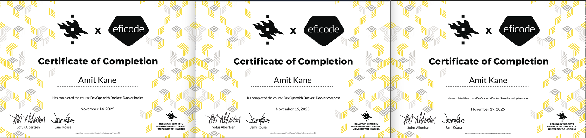

## [DevOps with Docker - University of Helsinki MOOC Trilogy](https://courses.mooc.fi/org/uh-cs/courses/devops-with-docker)
**3 Certificates** | **Full Docker Stack** | **Precursor to Kubernetes**

**Title: "DevOps with Docker - 3 Certs"**    

## Certificates
| Part | Certificate | Date |
|------|-------------|------|
| Docker Basics |  | [November 14, 2025] |
| Docker Compose |  | [November 16, 2025] |
| Docker Security and Optimization |  | [November 19, 2025] |

[ 
